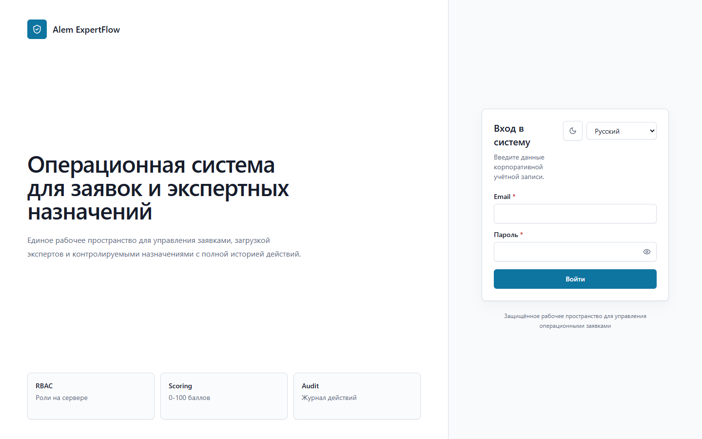
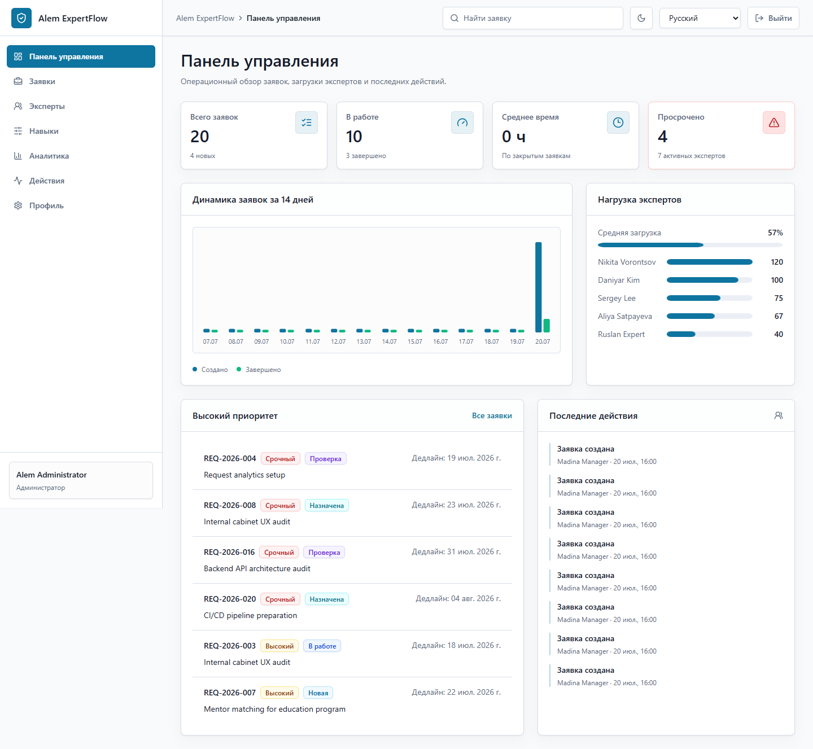
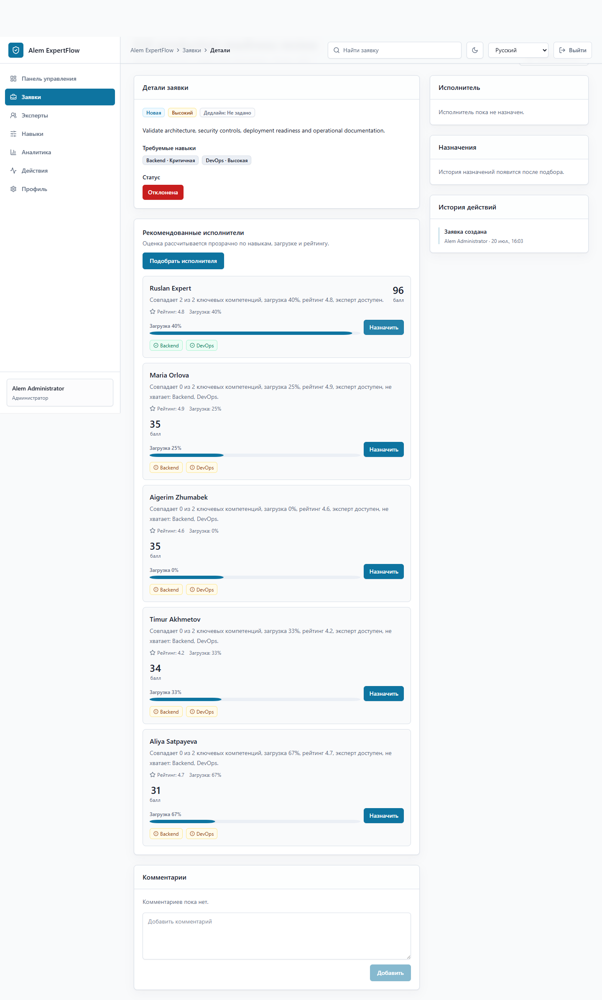
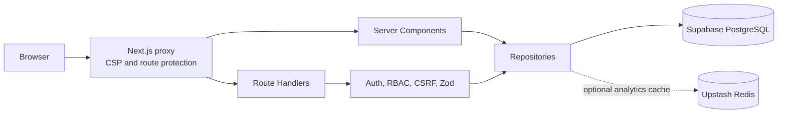

# Alem ExpertFlow

[](https://github.com/fakha2009/Alem-ExpertFlow/actions/workflows/ci.yml)
[](https://nextjs.org/)
[](https://www.typescriptlang.org/)
[](https://supabase.com/)
[](https://alem-expertflow.vercel.app/)

Alem ExpertFlow is a full-stack operations platform for request intake, expert capacity management, explainable skills-based matching and auditable assignment workflows.

Production URL: [alem-expertflow.vercel.app](https://alem-expertflow.vercel.app/). The web deployment and public login are healthy; authenticated production workflows require the unavailable Supabase project to be restored or replaced, as documented in [OPS-001](docs/security-audit.md#ops-001--unavailable-hosted-database).

## Product overview

Operations teams use one controlled workflow to register work, prioritise requests, find qualified experts and track delivery. Managers receive deterministic recommendations with visible scoring factors, experts see only their assigned work, and administrators retain an audit trail for business-critical changes.

## Key features

- Request lifecycle, priorities, deadlines, comments and status transitions
- Expert profiles, capacity, availability, ratings and proficiency-based skills
- Deterministic 0–100 matching with server-side score recalculation
- Server-enforced RBAC for admin, manager, expert and viewer roles
- Dashboard, aggregate analytics, filtering, search and pagination
- Atomic assignment and workload accounting in PostgreSQL transactions
- Signed, revocable httpOnly sessions and persistent login throttling
- Same-origin mutation checks, request size limits and strict nonce-based CSP
- Russian, English and Kazakh interface; light and dark themes
- Versioned SQL migrations and Vercel-ready deployment configuration

## Screenshots

### Login



### Operations dashboard



### Explainable expert matching



Screenshots were captured from the verified production build at 1440×900 against a disposable migrated PostgreSQL 17 database. They contain generated demo data only.

## Tech stack

| Layer | Technology |
| --- | --- |
| Web | Next.js 16 App Router, React 19, TypeScript |
| UI | Tailwind CSS, Lucide, TanStack Table, React Hook Form |
| Validation | Zod on API boundaries and shared form contracts |
| Data | PostgreSQL/Supabase, Drizzle ORM, `postgres` driver |
| Authentication | bcrypt password hashes, signed JWT cookie sessions |
| Cache | Optional Upstash Redis for short-lived analytics caching |
| Delivery | GitHub Actions and Vercel |

## Architecture



```text
src/
  app/                  App Router pages and route handlers
  components/           UI primitives, layout and feature components
  lib/                  Shared constants, i18n and browser utilities
  server/
    auth/               Sessions, passwords and login throttling
    cache/              Bounded memory / optional Redis cache
    db/                 Drizzle schema, client and SQL migrations
    permissions/        Server-side RBAC and workflow transitions
    repositories/       Transactional queries and aggregates
    services/           Matching, request security and HTTP errors
    validators/         Zod input contracts
tests/                   Deterministic unit and security-contract tests
```

Server Components read through repositories. Mutations enter through route handlers, validate the request origin and body, authenticate the current database-backed session, enforce RBAC and execute transactional repository operations. Credentials and privileged database access remain server-only.

## Role model

| Capability | Admin | Manager | Expert | Viewer |
| --- | :---: | :---: | :---: | :---: |
| View requests | ✓ | ✓ | Assigned only | ✓ |
| Create or edit requests | ✓ | ✓ | — | — |
| Delete requests | ✓ | — | — | — |
| Match and assign experts | ✓ | ✓ | — | — |
| Update request workflow | ✓ | ✓ | Limited assigned flow | — |
| Manage experts and skills | ✓ | ✓ | — | — |
| View analytics | ✓ | ✓ | Own workload | ✓ |
| View full activity log | ✓ | ✓ | — | — |

## Matching model

Recommendations use a deterministic weighted score:

| Component | Maximum |
| --- | ---: |
| Required skill coverage | 45 |
| Skill proficiency | 15 |
| Availability | 15 |
| Current workload | 15 |
| Rating | 5 |
| Relevant experience | 5 |

Unavailable or fully allocated experts are excluded. Assignment recalculates the selected recommendation server-side, so a client cannot forge its score or explanation.

## Database

Core tables are `users`, `experts`, `skills`, `expert_skills`, `requests`, `request_skills`, `assignments`, `comments`, `activity_logs` and `auth_rate_limits`.

The schema defines foreign keys, uniqueness and value checks plus indexes for frequent filters and joins. Migrations also reconcile historical workload counters, enforce one active assignment per request, link one expert profile per expert user and disable Data API access for application tables through RLS and revoked `anon`/`authenticated` privileges.

## Local setup

Requirements:

- Node.js 20.9–24 (Node.js 24 matches CI and Vercel)
- npm 10+
- A dedicated PostgreSQL database; Supabase is recommended

```bash
git clone https://github.com/fakha2009/Alem-ExpertFlow.git
cd Alem-ExpertFlow
npm ci
cp .env.example .env.local
npm run db:migrate
npm run dev
```

On Windows PowerShell, copy the environment file with:

```powershell
Copy-Item .env.example .env.local
```

The application is available at `http://localhost:3000`.

## Environment variables

| Variable | Required | Purpose |
| --- | --- | --- |
| `DATABASE_URL` | Yes | Pooled PostgreSQL connection used by the application |
| `DIRECT_DATABASE_URL` | Recommended | Direct PostgreSQL connection used only for migrations |
| `AUTH_SECRET` | Yes | Session signing secret with at least 32 characters |
| `ALLOW_DEMO_RESET` | No | Local destructive demo reset opt-in; keep `false` in production |
| `UPSTASH_REDIS_REST_URL` | No | Optional analytics cache endpoint |
| `UPSTASH_REDIS_REST_TOKEN` | No | Optional analytics cache credential |

Configure both Upstash variables or neither. Generate `AUTH_SECRET` with a cryptographically secure random generator. Never commit `.env`, `.env.local`, database passwords, access tokens or service-role keys.

## Local demo data

Demo seeding is destructive and refuses to run in production. Enable it only for a disposable local database:

```bash
ALLOW_DEMO_RESET=true npm run db:seed
```

PowerShell:

```powershell
$env:ALLOW_DEMO_RESET = "true"
npm run db:seed
```

Local seed users are defined in `src/server/services/demo-data.ts`. Do not deploy predictable demo credentials or seeded personal data to a public environment.

## Scripts

| Command | Description |
| --- | --- |
| `npm run dev` | Start the development server |
| `npm run build` | Create an optimized production build |
| `npm run start` | Run the production build |
| `npm run lint` | Run ESLint |
| `npm run typecheck` | Type-check without emitting files |
| `npm test` | Run the Node test suite |
| `npm run test:coverage` | Run tests with built-in coverage output |
| `npm run check` | Run lint, type-check, tests and build |
| `npm run db:migrate` | Apply pending SQL migrations transactionally |
| `npm run db:seed` | Recreate local demo data with explicit opt-in |

## API surface

| Route | Method | Access |
| --- | --- | --- |
| `/api/auth/login` | POST | Public, persistently rate-limited |
| `/api/auth/logout` | POST | Authenticated |
| `/api/requests` | POST | Admin, manager |
| `/api/requests/:id` | PATCH / DELETE | Admin or manager / admin only |
| `/api/requests/:id/status` | POST | Role and workflow dependent |
| `/api/requests/:id/comments` | POST | Users with request access |
| `/api/requests/:id/match` | GET | Admin, manager |
| `/api/requests/:id/assign` | POST | Admin, manager |
| `/api/experts` | POST | Admin, manager |
| `/api/experts/:id` | PATCH | Admin, manager |
| `/api/skills` | POST | Admin, manager |
| `/api/preferences/locale` | POST | Same-origin browser request |

All mutation handlers reject unmarked or cross-origin requests. JSON content type, body size, UUID parameters and schema contracts are validated before repository execution.

## Quality and security

The CI workflow runs locked dependency installation, lint, type-checking, tests, production dependency audit and a production build. Current local verification:

- ESLint: pass
- TypeScript: pass
- Tests: 10/10 pass
- Covered test modules: 97.71% line coverage
- `npm audit`: 0 vulnerabilities
- Next.js production build: pass
- Browser smoke test: desktop and 390 px mobile pass, 0 console warnings/errors
- PostgreSQL integration: 7/7 migrations, idempotent rerun and demo seed pass
- End-to-end workflow: login → create → match → assign → comment → complete passes
- Response security: nonce CSP, clickjacking, MIME sniffing, referrer and permissions headers verified

See the [security audit](docs/security-audit.md), [security policy](SECURITY.md) and [production checklist](docs/production-checklist.md).

## Production deployment

1. Create or restore a dedicated Supabase project.
2. Add `DATABASE_URL`, `DIRECT_DATABASE_URL` and a unique `AUTH_SECRET` to Vercel. Keep `ALLOW_DEMO_RESET=false`.
3. Run `npm run db:migrate` from a trusted migration environment.
4. Run `npm run check` against the exact commit to promote.
5. Deploy with Vercel and verify login plus the complete request → match → assign → complete workflow.
6. Confirm the database backup, restore and rollback procedures before accepting real data.

Do not run `npm run db:seed` against production. The application intentionally fails closed when database or session configuration is missing.

## Troubleshooting

- `AUTH_SECRET must be set`: provide a random value of at least 32 characters.
- Migration connection errors: verify the Supabase project is active and use the direct connection string in `DIRECT_DATABASE_URL`.
- Runtime connection errors: use the transaction pooler URL in `DATABASE_URL` and check the pooler tenant/user value.
- Login returns a generic server error: check database reachability and migration status; credentials are never echoed to the client.
- Upstash errors: configure both Redis variables or remove both to use the bounded in-process analytics cache.

## Roadmap

- Email, Telegram and in-app notifications
- Secure file attachments and malware scanning
- SLA tracking and automated escalation
- Calendar-based availability
- Multi-tenant isolation and organisation administration
- End-to-end browser tests against disposable database branches

## Contributing

Use a focused branch and include tests for behaviour changes. Before opening a pull request, run:

```bash
npm run check
npm audit
```

Security reports must follow [SECURITY.md](SECURITY.md) rather than public issues.

## Author

[Mahmadkhonzoda Fakhriddin](https://github.com/fakha2009)

## License

No open-source license is granted. All rights reserved.
